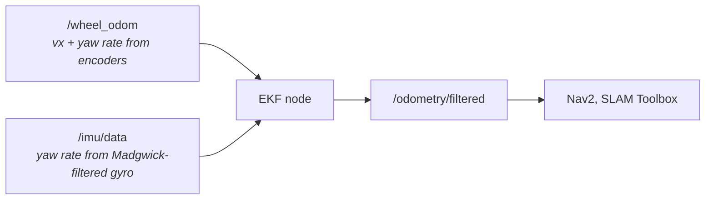

# EKF Guide — Robot Localization (robot_localization)

This guide explains the Extended Kalman Filter (EKF) as configured in `config/ekf.yaml` for the burgerbot project. The EKF fuses wheel odometry and IMU data to produce a smooth, drift-reduced pose estimate that Nav2 and SLAM Toolbox use as the odometry source.

---

## What the EKF Does

The EKF maintains a probabilistic estimate of the robot's state (position, orientation, velocity) by combining multiple noisy sensors. Each sensor provides partial information; the filter weights each measurement by how much it trusts it relative to its current prediction uncertainty.

For the burgerbot:



The output `/odometry/filtered` is the `odom → base_footprint` transform. SLAM Toolbox then computes `map → odom` on top of that.

---

## The 15-State Vector

`robot_localization` tracks a 15-element state vector. Every sensor configuration and covariance matrix uses this same ordering:

| Index | Symbol | Meaning | Unit |
|-------|--------|---------|------|
| 0 | x | Position X | m |
| 1 | y | Position Y | m |
| 2 | z | Position Z | m |
| 3 | roll | Orientation roll | rad |
| 4 | pitch | Orientation pitch | rad |
| 5 | yaw | Orientation yaw | rad |
| 6 | vx | Linear velocity X | m/s |
| 7 | vy | Linear velocity Y | m/s |
| 8 | vz | Linear velocity Z | m/s |
| 9 | vroll | Angular velocity roll | rad/s |
| 10 | vpitch | Angular velocity pitch | rad/s |
| 11 | vyaw | Angular velocity yaw | rad/s |
| 12 | ax | Linear acceleration X | m/s² |
| 13 | ay | Linear acceleration Y | m/s² |
| 14 | az | Linear acceleration Z | m/s² |

---

## Sensor Configuration

### Core Node Parameters

| Parameter | Value | What it does | Field impact |
|-----------|-------|--------------|--------------|
| `frequency` | `50.0` Hz | How often the EKF predict+update cycle runs | Higher = smoother output but more CPU. 50 Hz is standard for indoor robots. Nav2 works fine at 30 Hz minimum; below 20 Hz TF latency becomes noticeable |
| `two_d_mode` | `true` | Forces z, roll, pitch, vz, vroll, vpitch and their covariances to zero | Essential for a ground robot — prevents IMU tilt noise from corrupting the 2D pose. Always `true` for burgerbot |
| `publish_tf` | `true` | Publish the `odom → base_footprint` TF transform | Must be `true`. SLAM Toolbox and Nav2 both require this TF |
| `odom_frame` | `odom` | Name of the odometry frame | Must match the frame_id used in `/wheel_odom` messages and expected by Nav2 |
| `base_link_frame` | `base_footprint` | Name of the robot body frame | Must match the URDF's root link and Nav2's `robot_base_frame` |
| `world_frame` | `odom` | The "world" frame — either `map` (for absolute positioning) or `odom` (for relative) | Set to `odom` because SLAM Toolbox handles the `map → odom` transform separately. Never set to `map` when using SLAM Toolbox |

---

### Sensor 0 — Wheel Odometry (`/wheel_odom`)

```yaml
odom0: /wheel_odom
odom0_config: [false, false, false,   # x, y, z
               false, false, false,   # roll, pitch, yaw
               true,  false, false,   # vx, vy, vz
               false, false, true,    # vroll, vpitch, vyaw
               false, false, false]   # ax, ay, az
```

The config vector is `true` for each state the sensor provides reliable data for.

| Config index | State | Enabled | Why |
|-------------|-------|---------|-----|
| 0–5 | Position + orientation | `false` | Odometry position drifts — not used directly. The EKF integrates velocity instead |
| 6 (vx) | Forward velocity | `true` | Encoders give reliable linear velocity |
| 7–8 (vy, vz) | Lateral + vertical velocity | `false` | Differential drive cannot move sideways; z is irrelevant |
| 9–10 (vroll, vpitch) | Roll + pitch rate | `false` | Ground robot; `two_d_mode` zeroes these anyway |
| 11 (vyaw) | Yaw rate | `true` | Encoders compute differential yaw rate reliably |
| 12–14 (ax–az) | Accelerations | `false` | Not provided by wheel odometry |

| Parameter | Value | What it does | Field impact |
|-----------|-------|--------------|--------------|
| `odom0_differential` | `false` | Treat the odometry as an incremental (delta) measurement rather than absolute | `false` = use the velocities directly (vx, vyaw). Set `true` only if the odometry message provides absolute poses and you want the EKF to differentiate them |
| `odom0_relative` | `false` | Treat position measurements relative to the first received message | Keep `false`. Relative mode is only useful for GPS-style sensors that provide absolute global positions you want to anchor |

---

### Sensor 1 — IMU (`/imu/data`)

```yaml
imu0: /imu/data
imu0_config: [false, false, false,   # x, y, z
              false, false, false,   # roll, pitch, yaw
              false, false, false,   # vx, vy, vz
              false, false, true,    # vroll, vpitch, vyaw
              false, false, false]   # ax, ay, az
```

| Config index | State | Enabled | Why |
|-------------|-------|---------|-----|
| 3–5 (orientation) | `false` | The IMU provides absolute yaw, but using it would fight SLAM Toolbox's yaw corrections. Only gyro rate is used |
| 11 (vyaw) | `true` | The gyro measures yaw rate directly and is more accurate than encoder-derived yaw at high angular speeds |
| 12–14 (acceleration) | `false` | Linear acceleration from IMU is noisy and integrates to poor velocity. Not used |

| Parameter | Value | What it does | Field impact |
|-----------|-------|--------------|--------------|
| `imu0_differential` | `false` | Take orientation measurements as-is (absolute) | `false` because we're using the gyro rate (vyaw), not the absolute orientation |
| `imu0_remove_gravitational_acceleration` | `true` | Subtract the 9.81 m/s² gravity vector from the accelerometer readings before fusing | Must be `true` if you ever enable accelerometer indices (12–14). Currently those are `false`, but leave this `true` for correctness |

---

## Process Noise Covariance Matrix

This 15×15 diagonal matrix represents how much the filter expects the state to drift between prediction steps. Higher values = the filter trusts sensor measurements more than its own prediction; lower values = the filter trusts its prediction and smooths out sensor noise.

Burgerbot uses a diagonal matrix (off-diagonal elements are 0). The diagonal values are:

| Index | State | Value | Meaning |
|-------|-------|-------|---------|
| 0 | x | 1.0e-3 | Very low position drift expected (ground robot) |
| 1 | y | 1.0e-3 | Same |
| 2 | z | 1.0e-3 | Zero in 2D mode, but kept small |
| 3 | roll | 0.3 | Higher — ground contact can cause roll variation |
| 4 | pitch | 0.3 | Same for pitch |
| 5 | yaw | 0.01 | Low — gyro provides accurate yaw rate; yaw should be stable |
| 6 | vx | 0.5 | Moderate — wheel slip and terrain affect linear velocity |
| 7 | vy | 0.5 | Not physically meaningful for diff-drive; zero in 2D mode |
| 8 | vz | 0.1 | Zero in 2D mode |
| 9 | vroll | 0.3 | Not used; 2D mode |
| 10 | vpitch | 0.3 | Not used; 2D mode |
| 11 | vyaw | 0.01 | Low — IMU provides reliable yaw rate |
| 12–14 | ax, ay, az | 0.5 | Not fused; moderate to allow filter to predict naturally |

### How to Tune Process Noise

- **Lower a diagonal value** → the filter trusts its own prediction more → slower to respond to real motion changes → smoother but laggy
- **Raise a diagonal value** → the filter trusts sensor updates more → faster response → noisier output

Common tuning actions:

| Symptom | Adjustment |
|---------|-----------|
| Output pose is jerky or noisy | Lower process noise for the affected state (e.g. lower `vx` from 0.5 to 0.1) |
| Pose lags behind real motion | Raise process noise (e.g. raise `vyaw` from 0.01 to 0.05) |
| Robot drifts in a straight line | Raise trust in `vyaw` by lowering its noise, or check that IMU is active |
| Robot position jumps during turns | Possibly encoder slip — raise `vx` process noise so encoder velocity is trusted less |

---

## How to Add More Sensors

To add a second sensor (e.g. GPS, a second IMU), follow the pattern:

```yaml
# Add in ekf.yaml under ekf_node: ros__parameters:
odom1: /some_other_odom_topic
odom1_config: [false, false, false,
               false, false, false,
               true,  false, false,
               false, false, false,
               false, false, false]
odom1_differential: false
odom1_relative: false
```

Sensors are numbered sequentially: `odom0`, `odom1`, ..., `imu0`, `imu1`, etc. The EKF can fuse any combination.

---

## Monitoring the EKF

### Check that the filter is running

```bash
ros2 topic hz /odometry/filtered        # should be ~50 Hz
ros2 topic echo /odometry/filtered --once
```

### Watch the covariance

The pose covariance in `/odometry/filtered` is the EKF's own uncertainty estimate. The (0,0) and (1,1) entries are x and y position variance; the (5,5) entry is yaw variance. These grow when the robot moves without receiving measurements and shrink when measurements update the filter.

```bash
ros2 topic echo /odometry/filtered --field pose.covariance
```

### Inspect the TF tree

```bash
ros2 run tf2_tools view_frames
# Opens frames.pdf showing: map → odom → base_footprint → base_link → ...
```

Verify the `odom → base_footprint` transform exists and is being updated.

---

## Troubleshooting

### "Waiting for transform odom → base_footprint"

The EKF has not started or is not publishing TF. Check:
1. `publish_tf: true` in `ekf.yaml`
2. The node is running: `ros2 node list | grep ekf`
3. Both `/wheel_odom` and `/imu/data` are publishing before the EKF starts

### Pose drifts rapidly when rotating

The IMU is not contributing. Check `/imu/data` is publishing:
```bash
ros2 topic hz /imu/data
```
If the topic is present but yaw drift persists, verify `imu0_config` index 11 (vyaw) is `true`.

### Robot teleports or jumps

Usually caused by:
1. Inconsistent frame IDs in `/wheel_odom` (check `frame_id` and `child_frame_id`)
2. The IMU providing an absolute yaw orientation that conflicts with odometry — verify orientation indices (3–5) in `imu0_config` are `false`
3. SLAM Toolbox loop closure correcting `map → odom` (not an EKF problem — expected behavior)

### EKF output is extremely noisy

Lower the process noise covariance diagonal values for the affected states. If yaw is noisy, lower index 11 (vyaw) from 0.01 toward 0.001.

### EKF output doesn't track turns

Raise the process noise for vyaw (index 11) so the filter updates more aggressively from the IMU, or verify the IMU yaw rate has the correct sign (matching the coordinate frame convention).
