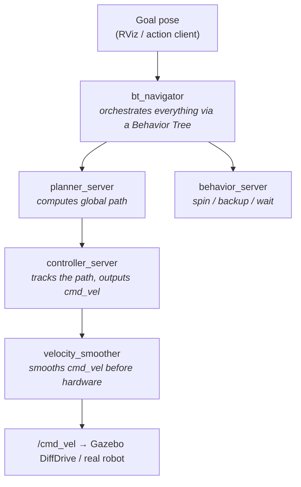

# Nav2 Guide — Autonomous Navigation Parameters

This guide explains the Nav2 (Navigation2) stack as configured in `config/nav2.yaml` for the burgerbot project. It covers every node, every parameter, and how each one affects the robot's real-world behavior.

---

## Architecture Overview

Nav2 is a collection of lifecycle nodes that together implement a complete autonomous navigation system. Data flows like this:



The **costmaps** are shared data structures used by both the planner and controller:

- **Global costmap** — whole-map view; used by `planner_server` to compute a path
- **Local costmap** — rolling window around the robot; used by `controller_server` to avoid real-time obstacles

---

## Using Nav2 in RViz

RViz is the cockpit for Nav2: you send navigation goals, set the robot's initial pose, and watch the planner, controller, and costmaps work in real time. This section walks through the full GUI workflow.

### Launching the stack with RViz

Run a navigation stack in one terminal and RViz in another (they share the ROS graph):

```bash
# Terminal 1 — Gazebo + SLAM + Nav2, headless
docker compose -f docker/docker-compose.yml run --rm sim-nav

# Terminal 2 — RViz with the burgerbot layout
xhost +local:docker
docker compose -f docker/docker-compose.yml run --rm rviz
```

Or use `sim-nav-gui` to get the Gazebo window too, with `rviz` alongside for the costmaps and goal tools.

### Step 1 — Set the Fixed Frame to `map`

The shipped config (`config/rviz/burgerbot.rviz`) uses **Fixed Frame: `odom`**. For navigation you must change it to `map`, otherwise the global path and costmap will appear to drift:

1. **Displays** panel → expand **Global Options**
2. Set **Fixed Frame** to **`map`**

### Step 2 — Set the robot's initial pose (localization mode only)

If you're navigating on a **saved map** (`localization.launch.py` / `nav_saved_map.launch.py`), Nav2/AMCL needs to know where the robot starts:

1. Click the **2D Pose Estimate** tool in the top toolbar
2. Click on the map where the robot actually is, and **drag in the direction it faces** before releasing
3. The laser scan (red) should snap onto the map walls. If it doesn't line up, repeat until it does.

> When mapping **and** navigating simultaneously (`sim-nav` / `slam_nav.launch.py`), SLAM Toolbox publishes `map → odom` directly — you do **not** need to set an initial pose.

> **Note:** The default `burgerbot.rviz` does not include the *2D Pose Estimate* tool. To add it: click the **+** in the toolbar → select **`rviz_default_plugins/SetInitialPose`**. By default it publishes to `/initialpose`, which is what AMCL listens on.

### Step 3 — Send a navigation goal

The burgerbot config already includes the Nav2 goal tool (`nav2_rviz_plugins/GoalTool`):

1. Click the **Nav2 Goal** tool (also labeled **2D Goal Pose**) in the top toolbar
2. Click the destination on the map and **drag to set the final heading**, then release
3. Nav2 plans a path and the robot starts driving

You can also send a goal from the command line:

```bash
ros2 topic pub --once /goal_pose geometry_msgs/PoseStamped \
  "{header: {frame_id: 'map'}, pose: {position: {x: 1.0, y: 0.5, z: 0.0}, orientation: {w: 1.0}}}"
```

### Step 4 — Watch the navigation happen

These displays are already enabled in the config:

| Display | Topic | What it shows | Color |
|---------|-------|---------------|-------|
| **GlobalPlan** | `/plan` | The full path the planner computed from robot to goal | green |
| **LocalPlan** | `/local_plan` | The short trajectory the controller is currently executing | blue |
| **Map** | `/map` | The static map being navigated | grayscale |
| **LaserScan** | `/scan` | Live LiDAR returns — should sit on the walls | red |
| **RobotModel** | `/robot_description` | The robot at its estimated pose | — |
| **TF** | — | Frames; confirm `map → odom → base_footprint` is connected | — |

A healthy run: the **green** global path stretches to the goal, the **blue** local path hugs the start of it and updates as the robot moves, and the robot follows smoothly.

### Step 5 — Add the costmap displays (not in the default config)

The costmaps are the single most useful thing to visualize when tuning Nav2, but they are **not** in the shipped layout. Add them manually:

**Local costmap** (rolling obstacle window around the robot):
1. Displays panel → **Add** → **By topic**
2. Select `/local_costmap/costmap` → **Map**
3. Set its **Color Scheme** to `costmap` so inflation gradients render correctly

**Global costmap** (whole-map planning layer):
1. **Add** → **By topic** → `/global_costmap/costmap` → **Map**
2. Set **Color Scheme** to `costmap`
3. Lower its **Alpha** to ~0.5 so you can still see the static map underneath

What the costmap colors mean:

| Color | Meaning |
|-------|---------|
| Pink / red cells | Lethal — an actual obstacle; the robot center can never enter |
| Blue → cyan halo | Inflated cost around obstacles (the `inflation_radius` zone). The planner avoids these when possible |
| Transparent / clear | Free space |

If the robot clips walls or refuses to enter a passage, the costmap display tells you immediately whether the inflation is too aggressive (`inflation_radius` too large) or an obstacle is being marked where there isn't one.

To make these displays permanent, **File → Save Config** to overwrite `burgerbot.rviz`.

### Step 6 — (Optional) Add the Nav2 panel

The Nav2 RViz panel gives you lifecycle controls (startup/shutdown), waypoint mode, and a navigation status readout:

1. **Panels → Add New Panel**
2. Select **`nav2_rviz_plugins/Navigation 2`**

From this panel you can click **Startup** to bring the lifecycle nodes up (if not autostarted), switch to **Waypoint / Nav Through Poses** mode to queue multiple goals, and **Cancel** an active navigation.

### Common RViz problems during navigation

| Symptom in RViz | Likely cause |
|-----------------|--------------|
| Everything drifts / global path slides around | Fixed Frame is still `odom` — set it to `map` |
| No green path appears after setting a goal | Planner failed — goal may be in an obstacle, or `map → odom` TF is missing |
| Robot model jumps far from the laser scan | Bad initial pose (localization mode) — re-run **2D Pose Estimate** |
| Costmap display is empty | Wrong topic or QoS — costmaps use transient-local; RViz handles this automatically when added "By topic" |
| Laser scan doesn't sit on the walls | Localization/EKF problem — see the [EKF guide](ekf_guide.md) |

---

## Controller Server

The controller server tracks the global path and outputs velocity commands.

**Plugin in use:** `RegulatedPurePursuitController`

### Top-level parameters

| Parameter | Value | What it does | Field impact |
|-----------|-------|--------------|--------------|
| `controller_frequency` | `10.0` Hz | How often the controller runs and sends a new `cmd_vel` | Lower = less CPU but laggier obstacle response. 10 Hz is fine for indoor speeds up to ~0.5 m/s. Raise to 20 Hz if the robot oscillates near obstacles |
| `min_x_velocity_threshold` | `0.001` m/s | Velocities below this are treated as zero when checking for stuck | Prevents false "robot is stopped" detections from encoder noise |
| `min_theta_velocity_threshold` | `0.001` rad/s | Same for angular velocity | Same purpose for yaw noise |
| `failure_tolerance` | `0.3` s | How long the controller can fail before triggering recovery | Raise if your hardware has occasional latency spikes. Lower for more aggressive recovery triggering |

### Progress Checker

Detects if the robot is stuck and triggers recovery behaviors.

| Parameter | Value | What it does | Field impact |
|-----------|-------|--------------|--------------|
| `required_movement_radius` | `0.5` m | Robot must move at least this far within `movement_time_allowance` | Too small = false stuck detections; too large = stuck robot goes undetected for too long |
| `movement_time_allowance` | `10.0` s | Time window for the robot to move `required_movement_radius` | Raise for very slow robots or wide open spaces where navigation takes long detours |

### Goal Checker

Declares success when the robot reaches the goal.

| Parameter | Value | What it does | Field impact |
|-----------|-------|--------------|--------------|
| `xy_goal_tolerance` | `0.05` m | Robot must be within 5 cm of the goal position | Tight (5 cm) is good for precise parking. Raise to 0.15–0.25 m for waypoint following where exact stopping doesn't matter |
| `yaw_goal_tolerance` | `0.1` rad | Robot must face within ~6° of the goal heading | 0.1 rad (~6°) is tight. Raise to 0.3–0.5 rad if final heading doesn't matter |

### Regulated Pure Pursuit Controller

Pure pursuit follows a carrot point ahead on the path. The "regulated" extensions add collision checking and curvature-based speed limiting.

| Parameter | Value | What it does | Field impact |
|-----------|-------|--------------|--------------|
| `desired_linear_vel` | `0.2` m/s | Target cruising speed | This is the robot's nominal forward speed. Raise for faster navigation (max ~1.0 m/s for burgerbot given URDF limits). Too fast = controller can't react in time |
| `lookahead_dist` | `0.6` m | Fixed lookahead distance (used when `use_velocity_scaled_lookahead_dist: false`) | Shorter = tighter path following but more oscillation. Longer = smoother but cuts corners. 0.6 m is a good indoor default |
| `min_lookahead_dist` | `0.3` m | Minimum lookahead when using velocity-scaled mode | Floor to prevent the controller from chasing a carrot that's on top of the robot |
| `max_lookahead_dist` | `0.9` m | Maximum lookahead when using velocity-scaled mode | Cap to prevent overshoot at high speed |
| `lookahead_time` | `1.5` s | When velocity-scaled, lookahead = speed × this value | At 0.2 m/s the lookahead would be 0.3 m (clamped to `min_lookahead_dist`). Increase to make the robot look further ahead at higher speeds |
| `use_velocity_scaled_lookahead_dist` | `false` | Scale lookahead with current speed | `true` gives smoother behavior at varying speeds. Currently `false` so the fixed 0.6 m is used |
| `rotate_to_heading_angular_vel` | `1.8` rad/s | Max angular speed during the rotate-to-heading phase | This is the in-place rotation speed used at the start of a goal. Raise to turn faster; lower if the IMU struggles with fast turns |
| `rotate_to_heading_min_angle` | `0.785` rad | Angular error (45°) above which the robot rotates in place before moving | At less than 45° error the robot drives while curving. At more it stops and turns first. Lower to 0.5 for smoother entry into paths |
| `use_rotate_to_heading` | `true` | Enable the rotate-in-place behavior at path start | Set `false` if your robot handles sharp initial curves well, or if you want it to move immediately |
| `allow_reversing` | `false` | Let the controller reverse to follow the path | `false` for a differential drive that prefers forward motion. Set `true` only if your path planner generates reverse segments |
| `max_angular_accel` | `3.2` rad/s² | Maximum angular acceleration | Limits how fast the turn rate can change. Too high = wheels skip or IMU saturates. Too low = robot can't react to sudden path changes |
| `min_approach_linear_velocity` | `0.05` m/s | Minimum speed when close to the goal | Prevents the robot from crawling to a full stop from 10 cm away — it always moves at least this fast until goal tolerance is met |
| `approach_velocity_scaling_dist` | `0.6` m | Start slowing to `min_approach_linear_velocity` this far from the goal | Larger = starts slowing earlier, smoother stop. Smaller = brakes later, can overshoot |
| `use_collision_detection` | `true` | Check for upcoming collisions on the path | Always leave `true`. Disabling it is unsafe |
| `max_allowed_time_to_collision_up_to_carrot` | `1.0` s | How far ahead (in time) to check for collisions | At 0.2 m/s this is 0.2 m ahead. Raise if the robot clips corners |
| `use_regulated_linear_velocity_scaling` | `true` | Slow down on high-curvature path segments | Prevents the robot from taking corners too fast. Leave `true` for indoor navigation |
| `regulated_linear_scaling_min_radius` | `0.9` m | Paths curving tighter than this radius trigger speed reduction | 0.9 m is the threshold for a "tight turn." Reduce for a smaller robot with a tighter turning radius |
| `regulated_linear_scaling_min_speed` | `0.25` m/s | Floor speed when regulated scaling is active | The robot won't slow below this even on tight corners. Must be ≤ `desired_linear_vel` |
| `use_cost_regulated_linear_velocity_scaling` | `false` | Also slow down when near high-cost cells (obstacles) | Useful in cluttered environments. Currently off; enable if the robot clips obstacles even with collision detection |
| `use_fixed_curvature_lookahead` | `false` | Use a fixed lookahead for curvature calculation instead of the dynamic one | Advanced tuning; leave `false` unless you understand the paper |
| `max_robot_pose_search_dist` | `10.0` m | How far from the robot to search for the nearest path point | Raise if the robot deviates far from the path (e.g. after recovery). Lower to avoid re-picking up the path from far away |

---

## Planner Server

Computes a collision-free global path from the robot's current pose to the goal.

**Plugin in use:** `NavfnPlanner` (Dijkstra / A*)

| Parameter | Value | What it does | Field impact |
|-----------|-------|--------------|--------------|
| `tolerance` | `0.5` m | If the exact goal is unreachable (inside an obstacle), plan to the nearest cell within this radius | 0.5 m is generous. Lower to 0.1 m if you need precise goal targeting. If planning fails often, raise it |
| `use_astar` | `false` | Use A* instead of Dijkstra | `false` = Dijkstra (finds the absolute shortest path). `true` = A* (faster computation, slightly non-optimal path). Switch to `true` in large maps where planning is slow |
| `allow_unknown` | `true` | Plan through unexplored cells (grey in the costmap) | `true` is required during SLAM — the robot must be able to enter unmapped areas. Set `false` only when using a fully known pre-built map and you never want the robot to enter unknown space |

---

## Behavior Server

Executes recovery behaviors when the robot gets stuck.

| Parameter | Value | What it does | Field impact |
|-----------|-------|--------------|--------------|
| `cycle_frequency` | `10.0` Hz | How fast the behavior server runs | Match to `controller_frequency` |
| `simulate_ahead_time` | `2.0` s | How far ahead to simulate during recovery planning | Longer = safer but slower recoveries |
| `max_rotational_vel` | `1.0` rad/s | Maximum rotation speed during spin recovery | Reduce if the robot tips or loses localization during fast spins |
| `min_rotational_vel` | `0.4` rad/s | Minimum rotation speed during spin recovery | Must be high enough to actually move against static friction |
| `rotational_acc_lim` | `3.2` rad/s² | Angular acceleration limit during recoveries | Match to `max_angular_accel` in the controller |

**Available recovery behaviors:**

| Behavior | What it does |
|----------|-------------|
| `spin` | Rotates in place to get a fresh view of the surroundings and clear the local costmap |
| `backup` | Drives straight backward a short distance to get unstuck |
| `wait` | Waits in place for obstacles to move (e.g. a person blocking the path) |

---

## BT Navigator

Orchestrates all Nav2 nodes using a Behavior Tree. The BT decides when to plan, when to control, when to recover, and when to declare success or failure.

| Parameter | Value | What it does | Field impact |
|-----------|-------|--------------|--------------|
| `odom_topic` | `/odometry/filtered` | Odometry source for the navigator | Must match the EKF output topic. Correct in this config |
| `bt_loop_duration` | `10` ms | How fast the BT ticks (100 Hz) | Higher frequency = faster reaction to failures. Do not lower below 10 ms |
| `default_server_timeout` | `20` s | How long to wait for a server to respond before declaring failure | Raise if Nav2 nodes take a long time to start (common in simulation) |
| `wait_for_service_timeout` | `1000` ms | Timeout for individual service calls | Raise to 2000 ms if you see timeouts in slow environments |

---

## Velocity Smoother

Filters `cmd_vel` to enforce acceleration/deceleration limits before the command reaches the robot.

| Parameter | Value | What it does | Field impact |
|-----------|-------|--------------|--------------|
| `smoothing_frequency` | `20.0` Hz | How often the smoother outputs a new command | Should be ≥ `controller_frequency`. 20 Hz gives smooth interpolation between 10 Hz controller outputs |
| `feedback` | `OPEN_LOOP` | `OPEN_LOOP` assumes the robot follows commands exactly; `CLOSED_LOOP` reads actual velocity from odometry | `CLOSED_LOOP` is more accurate but requires reliable odometry at high rate. `OPEN_LOOP` is simpler and works well in simulation |
| `max_velocity` | `[0.3, 0.0, 1.0]` | Max linear (x, y) and angular velocity [m/s, m/s, rad/s] | 0.3 m/s linear, 1.0 rad/s angular. Raise linear for faster navigation; must be within the robot's mechanical limits (~1.25 m/s for burgerbot with the fixed URDF) |
| `min_velocity` | `[-0.3, 0.0, -1.0]` | Min (most negative) velocities — allows reversing up to 0.3 m/s | Symmetric with max. Change the first value to `0.0` if you never want to reverse |
| `max_accel` | `[2.5, 0.0, 3.2]` | Max acceleration [m/s², m/s², rad/s²] | Controls how fast speed ramps up. Too high = wheels slip in real hardware. Lower (e.g. `1.0`) for gentler acceleration in real-world use |
| `max_decel` | `[-2.5, 0.0, -3.2]` | Max deceleration (must be negative) | Controls how fast the robot stops. Too aggressive = slides in real hardware |
| `odom_duration` | `0.1` s | Window size for velocity estimation in `CLOSED_LOOP` mode | Not used in `OPEN_LOOP`; leave as-is |
| `velocity_timeout` | `1.0` s | If no new `cmd_vel` arrives within this time, stop the robot | Safety timeout — prevents runaway if the controller crashes |

---

## Waypoint Follower

Navigates to a sequence of waypoints sequentially.

| Parameter | Value | What it does | Field impact |
|-----------|-------|--------------|--------------|
| `loop_rate` | `20` Hz | How fast the waypoint follower checks goal completion | Standard rate; no need to change |
| `stop_on_failure` | `false` | If a waypoint fails, skip it and continue to the next | `false` = tolerant multi-waypoint missions. Set `true` if every waypoint is critical |
| `action_server_result_timeout` | `900.0` s | Maximum time to complete the entire waypoint sequence | 15 minutes. Raise for very long missions |
| `waypoint_pause_duration` | `200` ms | How long to pause at each waypoint before moving to the next | Raise to give sensors or actuators time to act at each waypoint |

---

## Local Costmap

A rolling window centered on the robot. Used by the controller for real-time obstacle avoidance.

| Parameter | Value | What it does | Field impact |
|-----------|-------|--------------|--------------|
| `update_frequency` | `5.0` Hz | How often the costmap is rebuilt from sensor data | At 5 Hz new obstacles appear within 200 ms. Raise to 10 Hz for faster obstacle response; uses more CPU |
| `publish_frequency` | `2.0` Hz | How often the costmap is published for visualization | Only affects RViz display rate. Raise to match `update_frequency` for real-time visualization |
| `rolling_window` | `true` | Costmap follows the robot | Always `true` for the local costmap |
| `width` / `height` | `3` m × `3` m | Size of the rolling window | At 0.2 m/s the robot can travel 0.6 m before the costmap center shifts significantly. Raise for faster robots or longer lookahead corridors |
| `resolution` | `0.05` m | Same as the SLAM map resolution | Must match `slam_toolbox.yaml` resolution to avoid scaling artifacts |
| `robot_radius` | `0.105` m | Robot footprint radius used for inflation | ~10.5 cm is the burgerbot chassis radius. Raise slightly (e.g. `0.13`) to add a safety margin, especially in tight spaces |
| `raytrace_max_range` | `3.5` m | Raytrace clears the costmap up to this range ahead | Match to LiDAR `max_laser_range` |
| `obstacle_max_range` | `3.0` m | Mark obstacles up to this range | Slightly less than raytrace so far-field noise doesn't mark obstacles |

### Inflation Layer

Expands obstacles by a radius so the robot's center path keeps clearance.

| Parameter | Value | What it does | Field impact |
|-----------|-------|--------------|--------------|
| `inflation_radius` | `0.20` m | Obstacle influence extends this far beyond the obstacle cell | 20 cm means the path planner keeps the robot center at least 20 cm from walls. Raise (e.g. 0.3 m) in tight corridors for more conservative navigation; lower in very tight spaces where 20 cm is too restrictive |
| `cost_scaling_factor` | `3.0` | Rate at which cost decays with distance from an obstacle | Higher = cost drops off faster (robot prefers to stay away from walls but won't penalize paths near walls very much). Lower = robot stays further from walls. 3.0 is a neutral value |

---

## Global Costmap

A full-resolution copy of the SLAM map with obstacles overlaid. Used by the planner.

| Parameter | Value | What it does | Field impact |
|-----------|-------|--------------|--------------|
| `update_frequency` | `1.0` Hz | How often the global costmap is updated | 1 Hz is fine — global costmap changes slowly (only new SLAM data or far obstacles). Raise to 2–5 Hz in dynamic environments |
| `publish_frequency` | `1.0` Hz | Visualization publish rate | Match `update_frequency` |
| `track_unknown_space` | `true` | Mark unexplored cells as unknown (not free) | Required during SLAM mapping. Set `false` only if you have a complete pre-built map and want unknown cells treated as free space |
| `static_layer` `map_subscribe_transient_local` | `true` | Use transient-local QoS to receive the map even if subscribed after it was first published | Required for Nav2 to see the initial map from SLAM toolbox. Do not change |

---

## Troubleshooting

### Robot doesn't reach the goal — stays near it and gives up

Check `xy_goal_tolerance` (0.05 m is very tight). If the robot oscillates around the goal without satisfying the tolerance, raise to `0.10` or `0.15`.

### Robot takes very curved paths / cuts through obstacles

The `inflation_radius` in both costmaps determines obstacle clearance. If paths look wrong, first check that the costmap layers are correctly receiving `/scan` data:
```bash
ros2 topic echo /local_costmap/costmap --once
ros2 topic echo /global_costmap/costmap --once
```

### Planning fails with "No path found"

Usually caused by:
1. Goal inside an obstacle — raise `planner_server` `tolerance` to `1.0`
2. Costmap not updated — check `/scan` is publishing and `track_unknown_space` matches your use case
3. Robot footprint is too large relative to the passages in the map — reduce `robot_radius` or `inflation_radius`

### Robot oscillates or wobbles while following path

- Reduce `desired_linear_vel` (try `0.15`)
- Reduce `lookahead_dist` (try `0.4`)
- Raise `rotate_to_heading_min_angle` so the robot straightens out before moving

### Robot gets stuck and keeps retrying without recovering

Recovery behaviors are triggered in order by the BT. If `spin` + `backup` still leave the robot stuck, check whether the local costmap has stale obstacle data. Verify `update_frequency` is running and `/scan` data is arriving.

### Nav2 nodes die at startup with "bond timeout"

The `bond_timeout: 30.0` s in the lifecycle manager means the lifecycle manager waits up to 30 s for each node to activate. In simulation this can be slow on first launch. If nodes consistently fail to bond, check if they're actually running:
```bash
ros2 node list | grep nav2
```

---

## Quick Reference — Parameters Most Worth Tuning

| What you want to change | Parameter | Node |
|-------------------------|-----------|------|
| Robot speed | `desired_linear_vel` | `controller_server / FollowPath` |
| Stop accuracy | `xy_goal_tolerance` | `controller_server / general_goal_checker` |
| Turn speed at goal start | `rotate_to_heading_angular_vel` | `controller_server / FollowPath` |
| Path smoothness | `lookahead_dist` | `controller_server / FollowPath` |
| Obstacle clearance | `inflation_radius` | `local_costmap`, `global_costmap` |
| Recovery aggressiveness | `spin` / `backup` thresholds | `behavior_server` |
| Planning in unknown space | `allow_unknown` | `planner_server / GridBased` |
| Max speed cap | `max_velocity[0]` | `velocity_smoother` |
| Acceleration smoothness | `max_accel[0]` | `velocity_smoother` |
