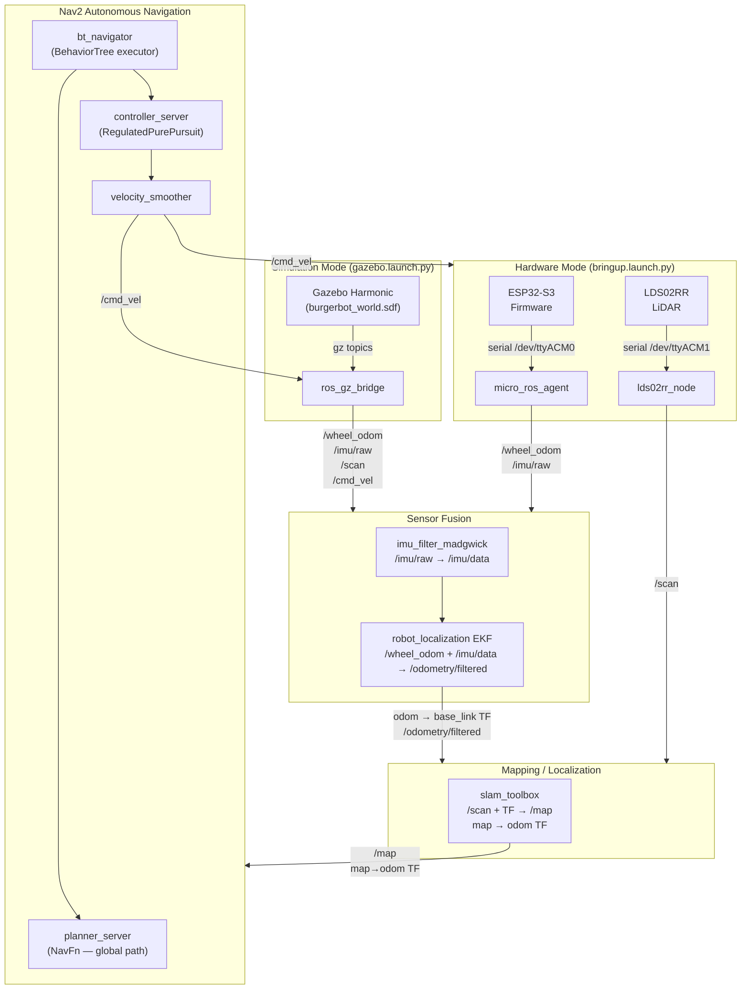
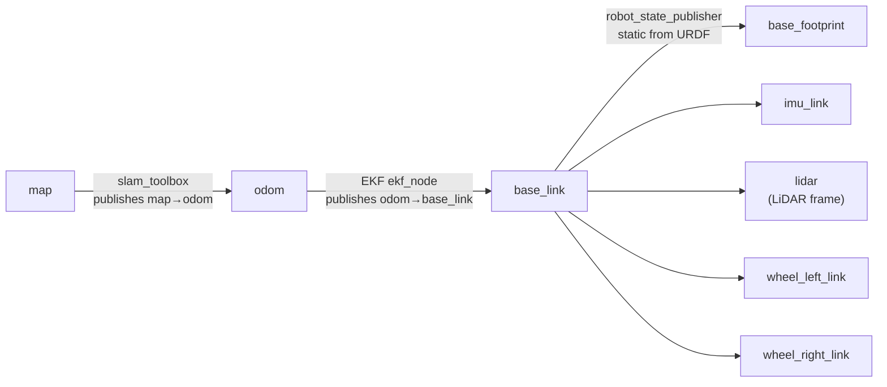
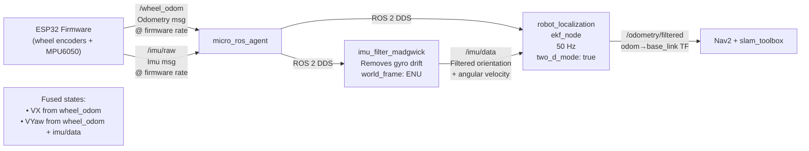
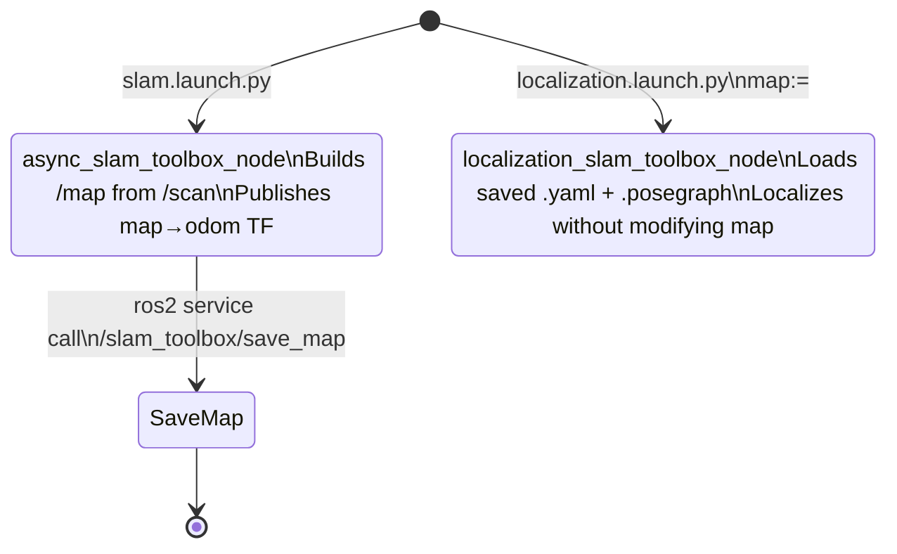
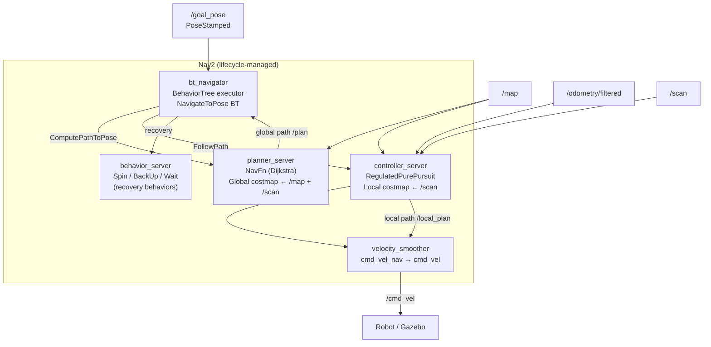
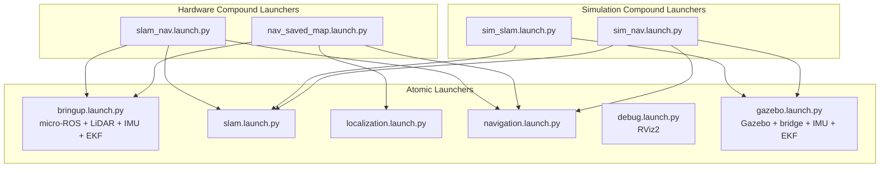
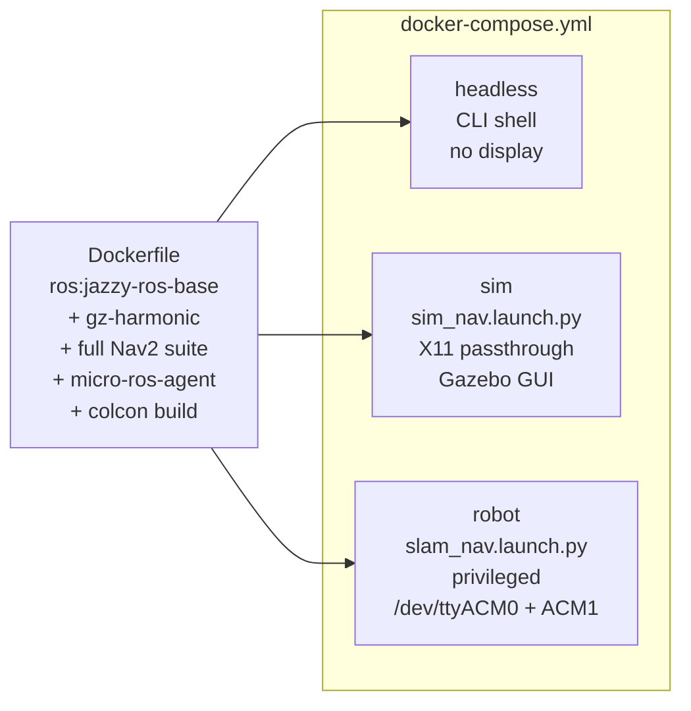

# burgerbot Architecture

How every component fits together — hardware path, simulation path, and the full autonomous navigation stack.

---

## 1. System Overview

Two runtime modes share the same SLAM, Nav2, and EKF configs. Only the sensor bringup differs.



---

## 2. Coordinate Frames (TF Tree)



Key rules:
- **EKF owns `odom → base_link`** — Gazebo DiffDrive plugin has `publish_odom_tf=false` to avoid conflict.
- **slam_toolbox owns `map → odom`** — no AMCL in this stack.
- **`lidar` frame** matches the `frame_id` published by `lds02rr_driver` (was `base_scan` in old URDF — mismatch fixed).

---

## 3. Sensor Fusion (EKF)



**What the EKF fuses:**

| Source | Fields used | Why |
|--------|-------------|-----|
| `/wheel_odom` | VX, VYaw | Forward velocity + turn rate from encoders |
| `/imu/data` | VYaw only | Gyro cross-checks turn rate, reduces encoder slip error |

Position (X, Y) is integrated from velocities — not measured directly.

---

## 4. SLAM Toolbox Modes



- **Mapping mode**: scans continuously added to map, map grows.
- **Localization mode**: map is frozen, robot localizes within it. `map_file_name` injected at launch time — no hardcoded paths.

---

## 5. Nav2 Stack Internals



`velocity_smoother` remaps: `cmd_vel_nav` (Nav2 output) → smoothed → `cmd_vel` (robot input). Prevents wheel slip from abrupt velocity commands.

---

## 6. Gazebo Simulation Path


**Critical SDF plugins** (missing from original — sensors produced no data):
```xml
<plugin filename="gz-sim-sensors-system" .../>
<plugin filename="gz-sim-imu-system" .../>
```

DiffDrive plugin sets `<publish_odom_tf>false</publish_odom_tf>` so EKF remains the sole publisher of `odom → base_link`.

---

## 7. Launch File Composition



Each atomic launcher is independently runnable for debugging a single subsystem. Compound launchers just include the atomics via `IncludeLaunchDescription`.

---

## 8. Docker Services



All three services share the same image. The difference is the command and device/display passthrough.

---

## 9. Design Decisions

| Decision | Rationale |
|----------|-----------|
| Single package replacing 5 | Eliminates cross-package path fragility and version skew |
| EKF owns `odom→base_link` (not firmware) | Fused estimate is more accurate; firmware odometry used as input only |
| No AMCL | SLAM Toolbox localization mode provides `map→odom` TF directly, no separate localizer needed |
| `bond_timeout: 30.0` in Nav2 | Old value was `0.0` which hides lifecycle failures silently |
| `robot_radius: 0.105 m` | Actual chassis radius 0.0825 m + 0.02 m safety margin |
| `lidar` frame (not `base_scan`) | Matches `lds02rr_driver` frame_id; old URDF mismatch caused empty costmaps |
| Wheel geometry from firmware | `radius=0.0625, sep=0.282` — old URDFs had `0.065/0.24` causing odometry drift |
| `publish_odom_tf=false` in Gazebo DiffDrive | Prevents TF conflict with EKF on the same `odom→base_link` edge |
