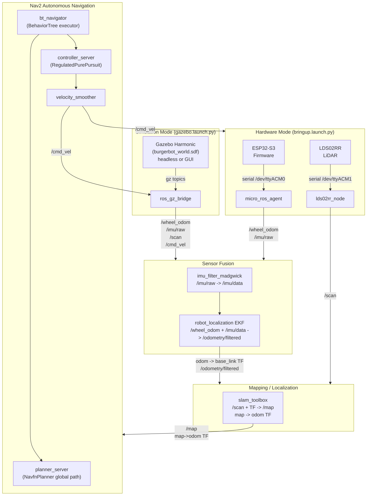
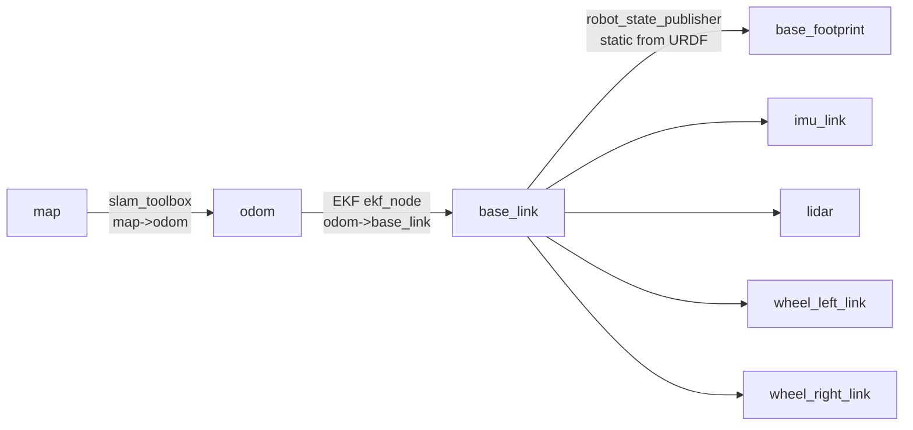
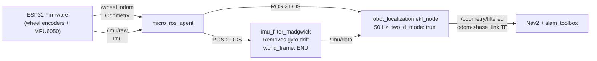
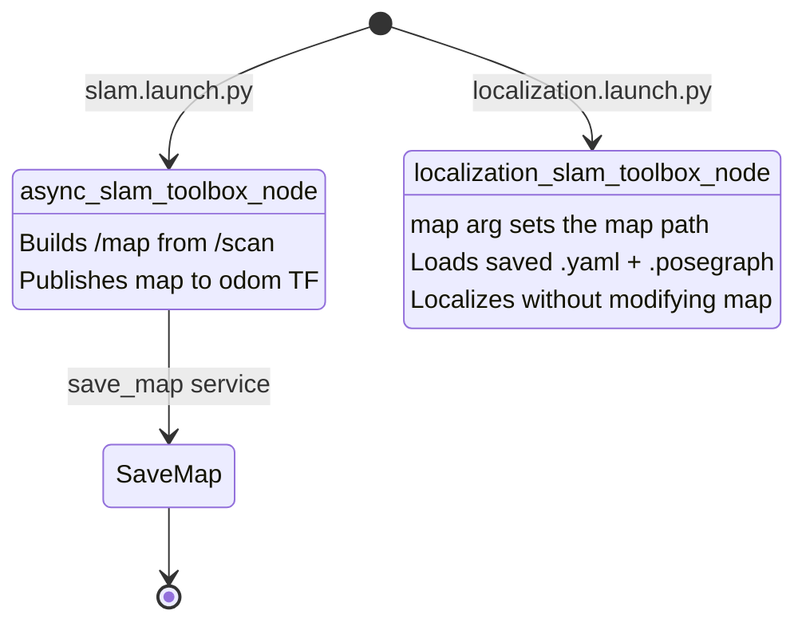
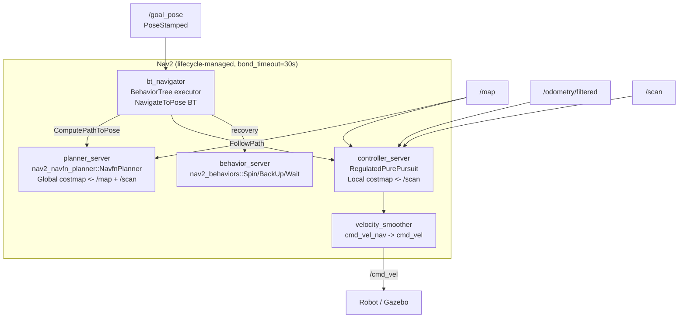
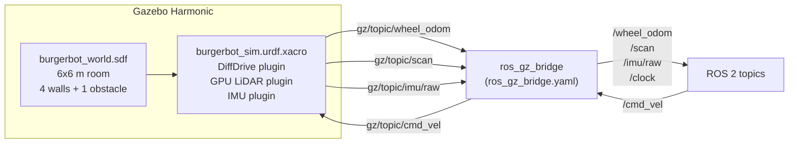
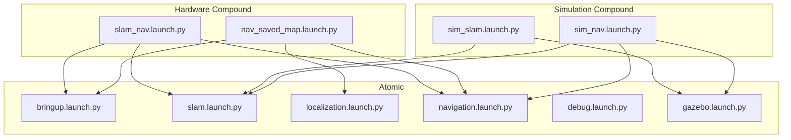
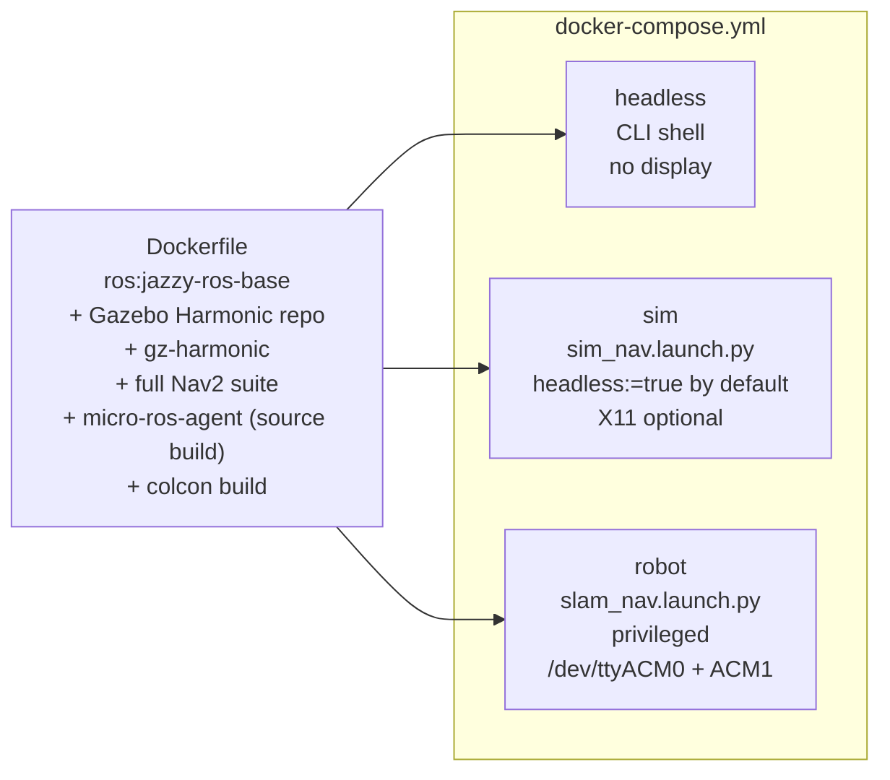

# burgerbot Architecture

How every component fits together — hardware path, simulation path, and the full autonomous navigation stack.

---

## 1. System Overview

Two runtime modes share identical EKF, SLAM, and Nav2 configs.
Only the sensor bringup layer differs.



---

## 2. Coordinate Frames (TF Tree)



Key rules:

- **EKF owns `odom -> base_link`** — Gazebo DiffDrive plugin has `publish_odom_tf=false` to avoid conflict.
- **slam_toolbox owns `map -> odom`** — no AMCL in this stack.
- **`lidar` frame** matches the `frame_id` published by `lds02rr_driver`.

---

## 3. Sensor Fusion (EKF)



| Source | Fields fused | Reason |
| ------ | ------------ | ------ |
| `/wheel_odom` | VX, VYaw | Forward velocity + turn rate from encoders |
| `/imu/data` | VYaw only | Gyro cross-checks turn rate, reduces encoder slip error |

All values in the `process_noise_covariance` matrix must be floats (`0.0` not `0`).
The RCL YAML parser rejects mixed integer/float sequences.

---

## 4. SLAM Toolbox Modes



`map_file_name` is injected at launch time via the `map:=` arg — no hardcoded paths in any config file.

---

## 5. Nav2 Stack Internals



`velocity_smoother` remaps `cmd_vel_nav` (Nav2 raw output) to `cmd_vel` (robot input)
to prevent wheel slip from abrupt velocity commands.

Plugin names use `::` separator (pluginlib convention in ROS 2 Jazzy):

- `nav2_navfn_planner::NavfnPlanner`
- `nav2_behaviors::Spin`, `nav2_behaviors::BackUp`, `nav2_behaviors::Wait`
- `nav2_bt_navigator::NavigateToPoseNavigator`

---

## 6. Gazebo Simulation Path



### Headless vs GUI mode

`gazebo.launch.py` supports a `headless` argument (default `true`):

```text
headless:=true   →  gz sim -s -r world.sdf   (server only, no Qt/X11)
headless:=false  →  gz sim -r world.sdf       (GUI, requires DISPLAY)
```

For GUI mode on Ubuntu, run `xhost +local:docker` before starting the container.

### Critical SDF plugins

These plugins must be in the world SDF or sensors produce no data:

```xml
<plugin filename="gz-sim-sensors-system" name="gz::sim::systems::Sensors">
  <render_engine>ogre2</render_engine>
</plugin>
<plugin filename="gz-sim-imu-system" name="gz::sim::systems::Imu"/>
```

DiffDrive plugin sets `<publish_odom_tf>false</publish_odom_tf>` so EKF
remains the sole publisher of `odom -> base_link`.

### Startup timing

The sim stack takes ~20 s to reach steady state:

1. Gazebo starts (headless or GUI)
2. Bridge connects → `/clock` flows
3. EKF receives clock → starts publishing `odom -> base_link`
4. SLAM receives `/scan` + TF → publishes `map -> odom`
5. Nav2 costmaps get both TFs → lifecycle activation completes

`Timed out waiting for transform` warnings during this window are normal.

---

## 7. Launch File Composition



---

## 8. Docker Services



`network_mode: host` means all ROS 2 topics (DDS) are visible on the host machine
without any port mapping.

---

## 9. Design Decisions

| Decision | Rationale |
| -------- | --------- |
| Single `burgerbot` package replacing 5 | Eliminates cross-package path fragility and version skew |
| EKF owns `odom->base_link` (not firmware) | Fused estimate more accurate; firmware odometry is input only |
| No AMCL | SLAM Toolbox localization mode provides `map->odom` directly |
| `bond_timeout: 30.0` in Nav2 | Old value was `0.0` which silently hides lifecycle failures |
| `robot_radius: 0.105 m` | Actual chassis 0.0825 m + 0.02 m safety margin |
| `lidar` frame (not `base_scan`) | Matches `lds02rr_driver` frame_id; wrong name → empty costmaps |
| `reverse_scan=true` in LiDAR driver | LDS02RR scans CW; LaserScan convention is CCW. The LDS library outputs raw CW angles (`cw=true`). Index is reversed via `(360 - raw) % 360` so CCW-increasing LaserScan angles map to correct physical directions. |
| Wheel geometry from firmware | `radius=0.0625, sep=0.282`; old URDFs had wrong values causing odometry drift |
| `publish_odom_tf=false` in Gazebo DiffDrive | Prevents TF conflict with EKF on `odom->base_link` |
| `ParameterValue(value_type=str)` on `robot_description` | ROS 2 Jazzy launch auto-parses `Command()` output as YAML; URDF XML breaks YAML parsing |
| `pi` removed from URDF properties | xacro in ROS 2 Jazzy provides `pi` as built-in; redefining it emits stderr → `Command()` throws |
| All covariance values as floats (`0.0`) | RCL YAML parser rejects mixed integer/float sequences in arrays |
| Plugin names use `::` separator | pluginlib in ROS 2 Jazzy uses `::` not `/` for class IDs |
| `headless:=true` default in gazebo.launch.py | Allows Docker usage without X11/display server |
| micro-ros-agent built from source | No deb package exists for ROS 2 Jazzy; snap not usable in Docker |
| Gazebo Harmonic apt repo added separately | `ros:jazzy-ros-base` only ships the ROS 2 repo; `gz-harmonic` is on osrfoundation |
